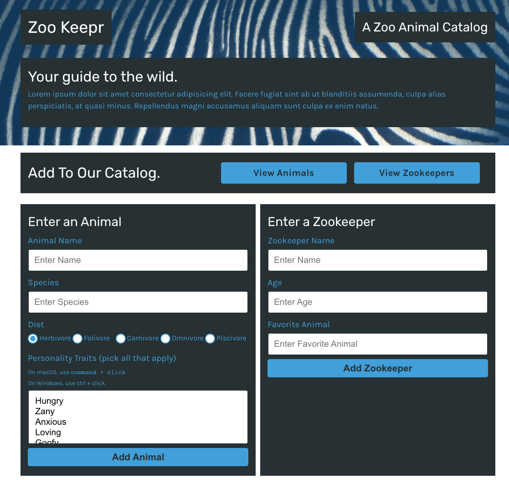

# ZOOKEEPR

## Description
Zookeepr is a a dedicated Express.JS application built for zookeepers to internally manage their animal and employee database. In this application, a zookeeper can add animals and/or zookeepers to the database using built in forms that uses API calls to the backend and adds to the database by ID. Also, this application has search capabilities and allows a user to search for animals by name, species, diet, and/or personality traits, and zookeepers by name, age, and their favorite animal.

Zookeeper's backend was built using node.js on a localHost environment, and tested API get/post calls using Insomnia core. Zookeepr's production enviroment was deployed on Heroku server. 

## Functionality

* Used Express.JS to create a Node.JS web server

* Setup GET routes to serve selective JSON data based on paramenters `req.param` and `req.query`

* Used Heroku to deploy a production environment server

* Created POST routes to allow server to accept incoming data and tested using Insomnia Core

* Validated data and utilized middleware in express.js

* Updated server to serve client-side code for users to interface with

* Modularized and scaled API by using Express.js Router

* Tested application using Jest and assisted in developing a predictable application to account for scalability

## Langugages
* Node.js
* Javascript
* HTML
* CSS
* Express.js
* NPM - Jest
* CDN - Bootstrap, JQuery

## Website
https://evening-refuge-50948.herokuapp.com/

## Reference Images
